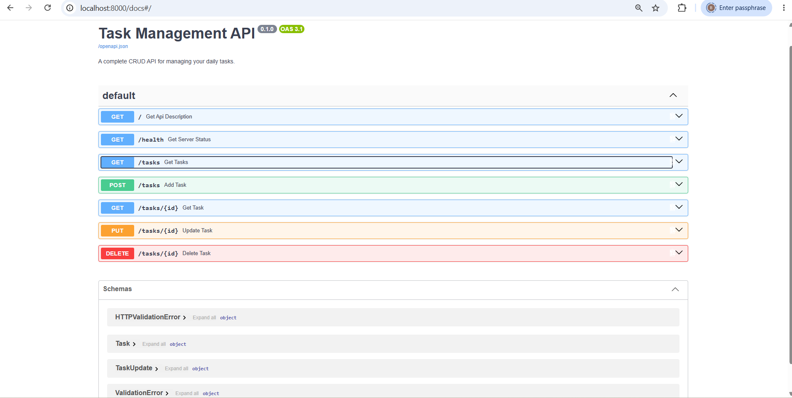

# Task Management API

A simple RESTful API built with **FastAPI** for managing daily tasks.

The API supports creating, retrieving, updating, and deleting tasks using standard CRUD operations. Tasks contain a title, completion status, and a unique ID.

## Features

* Create new tasks
* Get all tasks
* Get a task by ID
* Update a task
* Delete a task
* Input validation using Pydantic
* HTTP error handling
* Automatic interactive Swagger documentation
* Health-check endpoint

## Installation & Running

Install the project dependencies:

```bash
pip install fastapi uvicorn
```

Run the API:

```bash
uvicorn main:app --reload
```

The API will be available at:

```text
http://127.0.0.1:8000
```

Interactive Swagger documentation:

```text
http://127.0.0.1:8000/docs
```

## API Endpoints

| Method | Endpoint      | Description         | Success          | Errors                             |
| ------ | ------------- | ------------------- | ---------------- | ---------------------------------- |
| GET    | `/`           | Get API information | `200 OK`         | —                                  |
| GET    | `/health`     | Check server status | `200 OK`         | —                                  |
| GET    | `/tasks`      | Get all tasks       | `200 OK`         | —                                  |
| GET    | `/tasks/{id}` | Get a specific task | `200 OK`         | `404 Not Found`                    |
| POST   | `/tasks`      | Create a new task   | `201 Created`    | `400 Bad Request`                  |
| PUT    | `/tasks/{id}` | Update a task       | `200 OK`         | `400 Bad Request`, `404 Not Found` |
| DELETE | `/tasks/{id}` | Delete a task       | `204 No Content` | `404 Not Found`                    |

## Task Format

A task has the following structure:

```json
{
  "id": 1,
  "title": "Study FastAPI",
  "done": false
}
```

When creating a task, the `id` is generated automatically.

Example request body:

```json
{
  "title": "Study FastAPI",
  "done": false
}
```

## Example Request

Create a task:

```bash
curl -i -X POST "http://127.0.0.1:8000/tasks" ^
  -H "Content-Type: application/json" ^
  -d "{\"title\":\"Study FastAPI\",\"done\":false}"
```

Example response:

```text
HTTP/1.1 201 Created
content-type: application/json

{
  "id": 1,
  "title": "Study FastAPI",
  "done": false
}
```

## Example `curl -i` Output

```text
$ curl -i http://127.0.0.1:8000/health

HTTP/1.1 200 OK
date: ...
server: uvicorn
content-length: 15
content-type: application/json

{"status":"ok"}
```

## Swagger Documentation

FastAPI automatically generates interactive API documentation using Swagger UI.

Open:

```text
http://127.0.0.1:8000/docs
```

The Swagger interface allows you to explore every endpoint and send requests directly to the API.

### Swagger Screenshot

> Replace the placeholder below with a screenshot of your running `/docs` page.



## Error Handling

The API returns appropriate HTTP status codes for invalid operations.

Examples:

* `400 Bad Request` — invalid or empty request data
* `404 Not Found` — requested task ID does not exist
* `201 Created` — task successfully created
* `200 OK` — successful retrieval or update
* `204 No Content` — task successfully deleted

## Project Structure

```text
flyrank-backend-assignment1/
│
├── main.py
└── README.md
```

## Technologies

* Python
* FastAPI
* Pydantic
* Uvicorn
